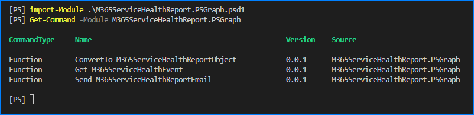
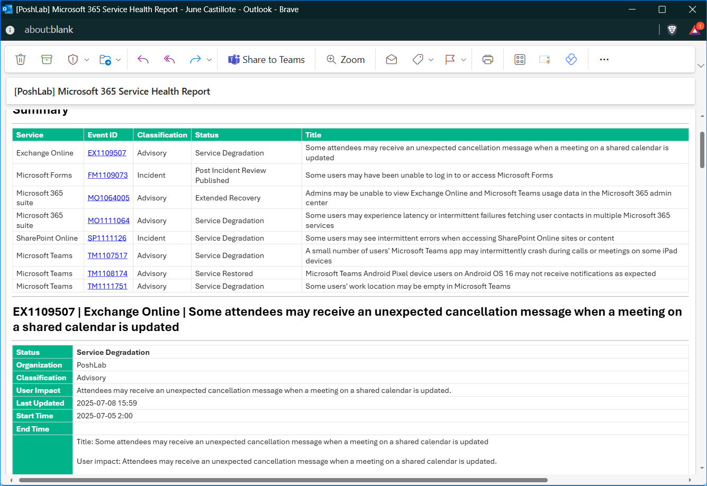

# M365ServiceHealthReport.PSGraph

This module is a wrapper of selected Microsoft Graph API PowerShell cmdlets that retrieves the [Service Communications API in Microsoft Graph](https://learn.microsoft.com/en-us/graph/api/resources/service-communications-api-overview).

- [Features](#features)
- [Requirements](#requirements)
  - [System](#system)
  - [Entra ID App](#entra-id-app)
  - [Communication](#communication)
- [How to Get the Module](#how-to-get-the-module)
- [Functions](#functions)
- [Usage Flow](#usage-flow)
- [Sample Run Script](#sample-run-script)
- [Sample Report](#sample-report)
  - [Email](#email)
  - [Teams](#teams)
- [ANNEX](#annex)

## Features

The module includes functions that retrieves service health events, generates a report, and send the report via email or Teams.

- Adaptable to interactive (manual) and unattended (automation) jobs.
- Get service health reports created or updated within a given timeframe.
- Get service health reports since its last run (historical).
- Convert the service health report to HTML and/or Teams Card.
- Send the report via email (Full)
- Sent the report via Teams webhook (Heading)

## Requirements

### System

- Windows PowerShell 5.1 or PowerShell 7+ (recommended).
- The [Microsoft Graph PowerShell](https://learn.microsoft.com/en-us/powershell/microsoftgraph/installation) module.

### Entra ID App

Before using this module, the PowerShell session must establish a connection with Microsoft Graph using the [Connect-MgGraph](https://learn.microsoft.com/en-us/powershell/module/microsoft.graph.authentication/connect-mggraph) cmdlet.

> Refer to: [Authentication module cmdlets in Microsoft Graph PowerShell](https://learn.microsoft.com/en-us/powershell/microsoftgraph/authentication-commands).

- For **manual / interactive** use, registering a separate app is optional. The first-party Microsoft Graph API PowerShell app which already exists should suffice.

- For **automated / unattended** use, a separate Entra ID application registration is required with the following configuration:
  - API: Microsoft Graph API
  - Permissions: `ServiceMessage.Read.All`, `ServiceHealth.Read.All`, `Mail.Send`

  > Refer to [Registering Azure AD App for Automation](resource/docs/ANNEX/register-app/Registering-Azure-AD-App-for-Automation.md).

### Communication

- Email: For **manual / interactive** use, the logged in user must have a licensed user mailbox.
- Email: For **automated / unattended** use, Any valid mailbox, or a shared mailbox, even without a license, can be used.
- Teams: A valid Teams webhook URL generated from a Power Automate workflow with a "**When a Teams webhook request is received**" trigger.

## How to Get the Module

1. [Download](https://github.com/junecastillote/M365ServiceHealthReport.PSGraph/archive/refs/heads/main.zip) or [clone](https://github.com/junecastillote/M365ServiceHealthReport.PSGraph.git) the repository's main branch.
2. Extract the downloaded zip to your preferred location.
3. Once downloaded, open PowerShell and import the module like so:

  ```powershell
  Import-Module .\M365ServiceHealthReport.PSGraph.psd1 -Force
  ```

## Functions

This module (as of version 0.0.2), has four public functions called `Get-M365ServiceHealthEvent`, `ConvertTo-M365ServiceHealthReportObject`, `Send-M365ServiceHealthReportToEmail`, `Send-M365ServiceHealthReportToTeams`.



Visit the below links to learn about each command.

- [Get-M365ServiceHealthEvent](resource/docs/Get-M365ServiceHealthEvent/Get-M365ServiceHealthEvent.md)
- [ConvertTo-M365ServiceHealthReportObject](resource/docs/ConvertTo-M365ServiceHealthReportObject/ConvertTo-M365ServiceHealthReportObject.md)
- [Send-M365ServiceHealthReportToEmail](resource/docs/Send-M365ServiceHealthReportToEmail/Send-M365ServiceHealthReportToEmail.md)
- [Send-M365ServiceHealthReportToTeams](resource/docs/Send-M365ServiceHealthReportToTeams/Send-M365ServiceHealthReportToTeams.md)

## Usage Flow

The commands included in this module can be used in this flow:

1. Get the events based on your criteria (previous days, since last run, unresolved only, etc.) using the `Get-M365ServiceHealthEvent` command.
2. Convert the events to a report to HTML or Teams Card or both, using the `ConvertTo-M365ServiceHealthReportObject` command.
3. Send the report via email or Teams or both using the `Send-M365ServiceHealthReportToEmail` and `Send-M365ServiceHealthReportToTeams` commands.

## Sample Run Script

The script below demonstrates one possible way to run generate the Microsoft 365 Health Report.

```PowerShell

# Connect to Microsoft Graph using a custom Entra ID app with a certificate credential.
Connect-MgGraph -TenantId poshlab.xyz -ClientId 3cf20865-66e7-42d5-83ca-0ba1fc7d6dbc -CertificateThumbprint 392010E284C3F9AB7A882DA50A31BCE4B2CBD3AE -NoWelcome

# Import the module
Import-Module .\M365ServiceHealthReport.PSGraph.psd1 -Force

# Define one or more Teams webhook URL as needed.
$teams_webhook_url = @(
    'https://prod-41.southeastasia.logic.azure.com/workflows/a79afa1becd845d0adb8d20f7f16eeba/triggers/manual/paths/invoke?api-version=2016-06-01&sp=%2Ftriggers%2Fmanual%2Frun&sv=1.0&sig=GzLlvK4jBB_XXXXXXXXXXXXXXXXXXX'
)

# Get the events from the last 24 hours
$events = Get-M365ServiceHealthEvent -LastModifiedDateTime (Get-Date).AddHours(-24)

# Convert the events to a report object. This report will include HTML and Teams Card content.
$report = $events | ConvertTo-M365ServiceHealthReportObject -OrganizationName PoshLab

# Send the report via Teams Webhook URL to trigger the Power Automate Flow
$report | Send-M365ServiceHealthReportToTeams -TeamsWebhookUrl $teams_webhook_url

# Send the report via email
$report | Send-M365ServiceHealthReportToEmail -MailFrom mailer365@poshlab.xyz -MailTo june@poshlab.xyz

```

## Sample Report

### Email



### Teams


## ANNEX

- [Registering Azure AD App for Automation](resource/docs/annex/register-app/Registering-Azure-AD-App-for-Automation.md)
- [How to Generate a Self-Signed Certificate for the App](resource/docs/ANNEX/new-cert/new-certificate.md)
