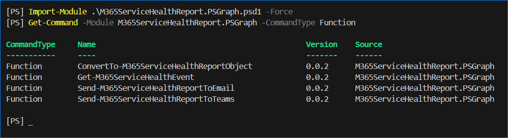

# M365ServiceHealthReport.PSGraph

This module is a wrapper of selected Microsoft Graph API PowerShell cmdlets that retrieves the [Service Communications API in Microsoft Graph](https://learn.microsoft.com/en-us/graph/api/resources/service-communications-api-overview).

The module includes functions that retrieves service health events, generates a report, and send the report via email.

- [Requirements](#requirements)
  - [System](#system)
  - [Permissions](#permissions)
- [How to Get the Module](#how-to-get-the-module)
- [Functions](#functions)

## Requirements

### System

- Windows PowerShell 5.1 or PowerShell 7+.
- The [Microsoft Graph PowerShell](https://learn.microsoft.com/en-us/powershell/microsoftgraph/installation) module.

### Permissions

Whether you're using delegated or app-only authentication, the following Microsoft Graph API permissions are required.

- `ServiceMessage.Read.All`, `ServiceHealth.Read.All`, `Mail.Send`
- A valid mailbox used for sending the report.
  - If delegated - the logged in user must have a licensed user mailbox.
  - If app-only - any valid mailbox, or a shared mailbox, even without a license, can be used.

## How to Get the Module

- [Download](https://github.com/junecastillote/M365ServiceHealthReport.PSGraph/archive/refs/heads/main.zip) or [clone](https://github.com/junecastillote/M365ServiceHealthReport.PSGraph.git) the repository's main branch.
- Extract the downloaded zip and/or go to the code folder.
- Once downloaded, open PowerShell and import the module like so:

  ```powershell
  Import-Module .\M365ServiceHealthReport.PSGraph.psd1
  ```

## Functions

This module (as of version 0.0.1), has three public functions called `Get-M365ServiceHealthEvent`, `ConvertTo-M365ServiceHealthReportObject`, `Send-M365ServiceHealthReportEmail`.



[Get-M365ServiceHealthEvent](resource/docs/Get-M365ServiceHealthEvent/Get-M365ServiceHealthEvent.md)

[ConvertTo-M365ServiceHealthReportObject](resource/docs/ConvertTo-M365ServiceHealthReportObject/ConvertTo-M365ServiceHealthReportObject.md)

[Send-M365ServiceHealthReportEmail](resource/docs/Send-M365ServiceHealthReportEmail.md)
