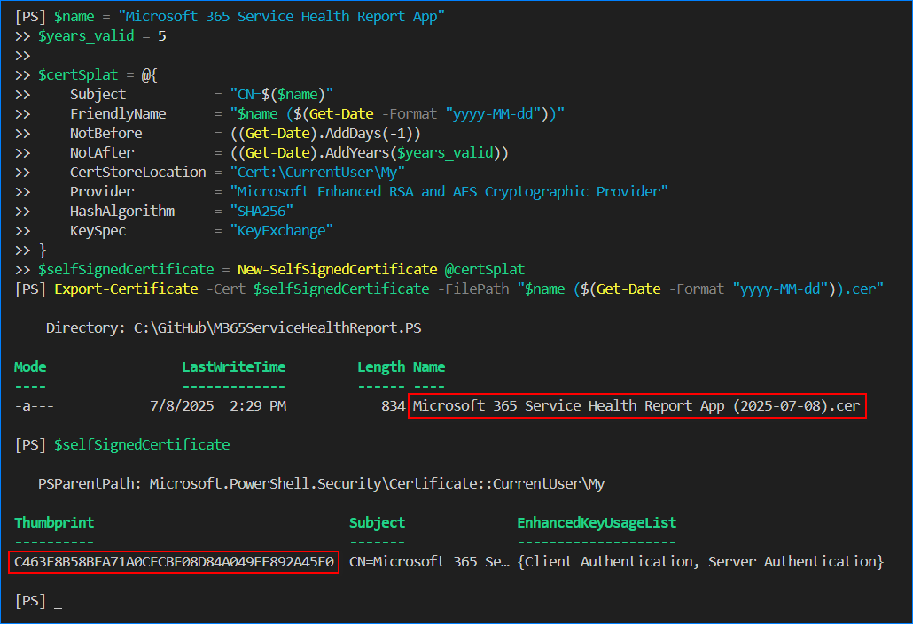
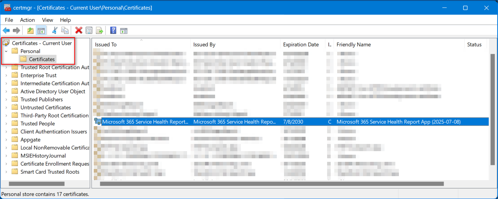

# How to Generate a Self-Signed Certificate for the App

This guide demonstrates creating a self-signed certificate consisting of the private and public keys. The public key is to be uploaded to the Azure AD app, while the private key will remain on the machine or distributed to other machines where the app will run.

Open a PowerShell window and run the following script to generate the self-signed certificate.

```PowerShell
# Create a self-sign certificate in the personal certificate store with 5-year validity.

$name = "Microsoft 365 Service Health Report App"
$years_valid = 5

$certSplat = @{
    Subject           = "CN=$($name)"
    FriendlyName      = "$name ($(Get-Date -Format "yyyy-MM-dd"))"
    NotBefore         = ((Get-Date).AddDays(-1))
    NotAfter          = ((Get-Date).AddYears($years_valid))
    CertStoreLocation = "Cert:\CurrentUser\My"
    Provider          = "Microsoft Enhanced RSA and AES Cryptographic Provider"
    HashAlgorithm     = "SHA256"
    KeySpec           = "KeyExchange"
}
$selfSignedCertificate = New-SelfSignedCertificate @certSplat

# Export the certificate (.CER)
Export-Certificate -Cert $selfSignedCertificate -FilePath "$name ($(Get-Date -Format "yyyy-MM-dd")).cer"

# Display the certificate
$selfSignedCertificate
```

What happens when you run the above script?

- Generates a self-signed certificate with the name "`Microsoft 365 Service Health Report App`". You may change the name by changing the `$name` value.
- The certificate is valid for five years. You can adjust this validity by changing the `$years_valid` value.
- The certificate is stored in your personal certificate store "`Cert:\CurrentUser\My`".
- The public key is exported to the current directory with the `.CER` extension. This is the certificate that you will upload to the Azure AD application.
- Displays the new certificate on the screen, make sure to copy the thumbprint value.



After running the code, you can see the new certificate is in the personal certificate store.



> NOTE: If you plan to deploy the script to another machine, make sure to export the PFX certificate to file using the [PowerShell Export-PfxCertificate](https://learn.microsoft.com/en-us/powershell/module/pki/export-pfxcertificate) cmdlet or [MMC](https://knowledge.digicert.com/solution/exporting-a-pfx-using-mmc) and import it to another machine.
