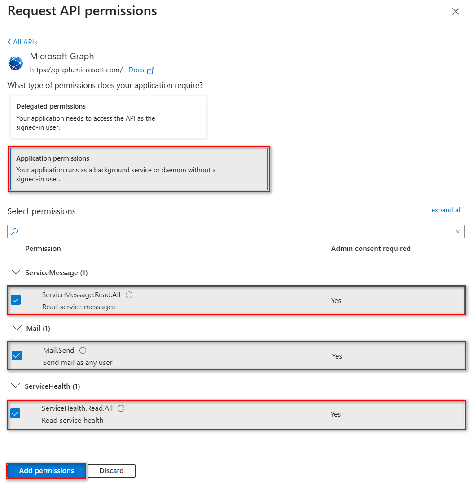
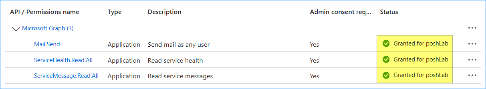
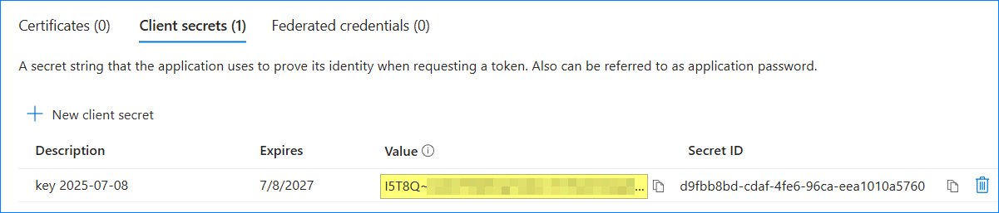

# Registering Azure AD App for Automation

Note: This procedure requires that you have one of the following Entra roles, from least to most privileged - *Cloud Application Administrator*, *Application Administrator*, *Global Administrator*.

- [Register a new app](#register-a-new-app)
- [Assign Application API Permissions](#assign-application-api-permissions)
- [Add a Client Secret Credential](#add-a-client-secret-credential)
- [Add a Certificate Credential](#add-a-certificate-credential)

## Register a new app

1. Sign in to the [Microsoft Entra admin center](https://entra.microsoft.com/).
2. Navigate to **Identity -> Applications -> App registrations** and click **New registration**.

    

3. Enter a name for your app. In this example, then app name is `Service Health Report App`.
4. Select **Accounts in this organizational directory only** under the **Supported account types**.
5. Under the **Redirect URI**, select **Web** as the platform and enter `http://localhost` for the URL.
6. Click **Register**.

   

7. Once registered, copy the **Application (client) ID** and **Directory (tenant) ID** values for later use.

    

## Assign Application API Permissions

1. While still on your app's page, click the **API permissions**.

   

2. By default, there is one API permission called `User.Read`. Delete this permisison first by clicking on the context menu (**...**) and **Remove permission**.

    

3. Now the permissions list is empty. Click **Add a permission**.

    

4. Click **Microsoft Graph** from the list of APIs.

    

5. Select **Application permission** and make sure to enable these permissions:

   - `ServiceMessage.Read.All` - Permission to read the announcements from the message center.
   - `ServiceHealth.Read.All` - Permission to read the service health status.
   - `Mail.Send` - Permission to send the report via email using a valid Exchange Online mailbox.

    Once the permissions are selected, click the **Add permissions** button.

    

6. The permissions are now added to the application, as you can see below, but they are not yet granted. Click the **Grant admin consent for [organization]** button.

    

7. Click **Yes** on the confirmation prompt.

    

    Each permission's status has now changed to **Granted for [organization]**.

    

## Add a Client Secret Credential

> **Note**: While the client secret key is a convenient type of app credential, a [certificate credential](#add-a-certificate-credential) is more secure as it does not expose a plain-text key.

A client secret key serves as the password of the application and must be kept as such. ***It has a maximum life of two years and has to be rotated before it expires or the app will stop working due to authentication failure***.

1. Navigate to the app's **Certificates & secrets** page and click **New client secret**.

    

2. Enter the key's description and when it expires, and click **Add**.

    

3. Once created, copy the new key value and keep it safe as you would a password.

    

## Add a Certificate Credential

1. Generate the certificate first if you don't have it yet. Refer to [How to Generate a Self-Signed Certificate for the App][new-cert]

    [new-cert]: ../new-cert/new-certificate.md

2. Once you have the certificate ready, navigate to the **Certificates & secrets** page of the app. and click **Upload certificate**.

    

3. Browse and select the certificate file and click **Add**.

    

4. Confirm the certificate is now visible in the list.

    
