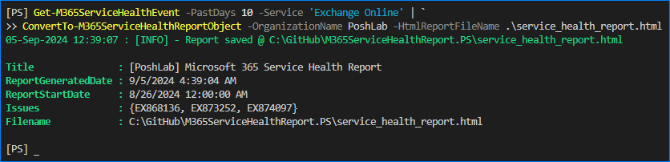

# ConvertTo-M365ServiceHealthReportObject

This function converts the output of the `Get-M365ServiceHealthEvent` function to a report object and can optionally save the output to an HTML file.

- [Syntax](#syntax)
- [Parameters](#parameters)
  - [-InputObject](#-inputobject)
  - [-OrganizationName](#-organizationname)
  - [-HtmlReportFileName](#-htmlreportfilename)
- [Examples](#examples)
  - [Example 1 - Save the HTML report to file](#example-1---save-the-html-report-to-file)
  - [Example 2 - Store the report object to a variable](#example-2---store-the-report-object-to-a-variable)
- [Output Type](#output-type)
- [NoteProperties](#noteproperties)
  - [OrganizationName](#organizationname)
  - [Title](#title)
  - [Filename](#filename)
  - [Content](#content)
  - [ReportGeneratedDate](#reportgenerateddate)
  - [ReportStartDate](#reportstartdate)
  - [Issues](#issues)
- [ScriptMethod](#scriptmethod)
  - [GetSummary](#getsummary)
  - [GetSummaryByService](#getsummarybyservice)

## Syntax

```PowerShell
ConvertTo-M365ServiceHealthReportObject [-InputObject] <MicrosoftGraphServiceHealthIssue> [-OrganizationName] <string> [[-Title] <string>] [[-HtmlReportFileName] <string>] [<CommonParameters>]
```

## Parameters

### -InputObject

This parameter accepts the `MicrosoftGraphServiceHealthIssue` object output of the `Get-M365ServiceHealthEvent` command. It can also accept the input through the pipeline.

|                        |                                  |
| ---------------------- | -------------------------------- |
| Type:                  | MicrosoftGraphServiceHealthIssue |
| Position:              | Named                            |
| Default value:         | None                             |
| Required:              | True                             |
| Accept pipeline input: | True                             |

### -OrganizationName

The organization name to appear in the report title.

|                        |        |
| ---------------------- | ------ |
| Type:                  | String |
| Position:              | Named  |
| Default value:         | None   |
| Required:              | True   |
| Accept pipeline input: | False  |

### -HtmlReportFileName

The full file path to save the option HTML report file.

|                        |        |
| ---------------------- | ------ |
| Type:                  | String |
| Position:              | Named  |
| Default value:         | None   |
| Required:              | False  |
| Accept pipeline input: | False  |

## Examples

### Example 1 - Save the HTML report to file

This example converts the `Get-M365ServiceHealthEvent` output to a report and save it to an HTML file called `service_health_report.html`.

```PowerShell
Get-M365ServiceHealthEvent -PastDays 10 -Service 'Exchange Online' | `
ConvertTo-M365ServiceHealthReportObject -OrganizationName PoshLab -HtmlReportFileName .\service_health_report.html
```



### Example 2 - Store the report object to a variable

This example converts the `Get-M365ServiceHealthEvent` output to a report without saving to an HTML file. The report is stored in a variable called `$report`.

```PowerShell
$service_health_event = Get-M365ServiceHealthEvent -PastDays 10 -Service 'Exchange Online'
$report = $service_health_event | ConvertTo-M365ServiceHealthReportObject -OrganizationName PoshLab
```


## Output Type

TypeName: M365ServiceHealthReport

## NoteProperties

The report object has the following properties.


### OrganizationName

This contains the organization name specified in the `-OrganizationName` parameter.

### Title

The title contains the report title, used as the title in the HTML content or email subject.

The title follows this standard format: `[OrganizationName] Microsoft 365 Service Health Report`.

There's currently no feature to customize the title.

### Filename

This shows the HTML filename, if the report is saved to a file.

### Content

This contains the HTML content of the report.


### ReportGeneratedDate

Shows the date when the report was generated.

### ReportStartDate

Shows the start date of the report items.

### Issues

The collection of service health issues used to generate the report.

## ScriptMethod

The report object has two ScriptMethods, as shown below.


### GetSummary

Calling this method uickly summarizes the number of service health issues, resolved, and unresolved.


### GetSummaryByService

This method aggregates the service health issues by service name.


