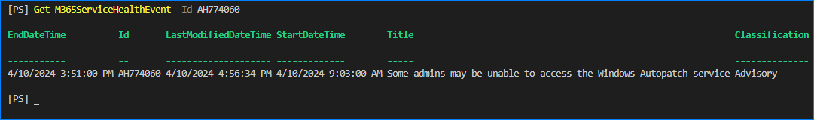

# Get-M365ServiceHealthEvent

This function retrieves the service announcements from Microsoft Graph.

- [Syntax](#syntax)
- [Parameters](#parameters)
- [Examples](#examples)
  - [Example 1 - Get all sservice health events](#example-1---get-all-sservice-health-events)
  - [Example 2 - Get a specific service health record ID](#example-2---get-a-specific-service-health-record-id)
  - [Example 3 - Get service health issues in the past 10 days and filter by service name](#example-3---get-service-health-issues-in-the-past-10-days-and-filter-by-service-name)
  - [Example 4 - Get all unresolved service health issues since the last successful run from history file](#example-4---get-all-unresolved-service-health-issues-since-the-last-successful-run-from-history-file)
- [Output Type](#output-type)

## Syntax

```PowerShell
Get-M365ServiceHealthEvent -Id <string> [<CommonParameters>]

Get-M365ServiceHealthEvent -PastDays <int> [-RunHistoryFileName <string>] [-Status <string>] [-Classification <string>] [-Service <string[]>] [<CommonParameters>]

Get-M365ServiceHealthEvent -LastModifiedDateTime <datetime> [-RunHistoryFileName <string>] [-Status <string>] [-Classification <string>] [-Service <string[]>] [<CommonParameters>]

Get-M365ServiceHealthEvent -StartFromLastSuccessfulRun -RunHistoryFileName <string> [-Status <string>] [-Classification <string>] [-Service <string[]>] [<CommonParameters>]

Get-M365ServiceHealthEvent [-RunHistoryFileName <string>] [-Status <string>] [-Classification <string>] [-Service <string[]>] [<CommonParameters>]
```

## Parameters

**-Id**

This parameter the event ID of the service announcement to retrieve.

|                        |        |
| ---------------------- | ------ |
| Type:                  | String |
| Position:              | Named  |
| Default value:         | None   |
| Required:              | True   |
| Accept pipeline input: | False  |

**-PastDays**

The period, in days, to retrieve the service announcements.

|                        |       |
| ---------------------- | ----- |
| Type:                  | Int32 |
| Position:              | Named |
| Default value:         | None  |
| Required:              | True  |
| Accept pipeline input: | False |

**-LastModifiedDateTime**

Sets the retrieval based on when the service health event was last modified or updated.

|                        |          |
| ---------------------- | -------- |
| Type:                  | DateTime |
| Position:              | Named    |
| Default value:         | None     |
| Required:              | True     |
| Accept pipeline input: | False    |

**-StartFromLastSuccessfulRun**

Limits the service health event retrieval based on the last time the command ran successfully as logged in the history file.

|                        |        |
| ---------------------- | ------ |
| Type:                  | Switch |
| Position:              | Named  |
| Default value:         | None   |
| Required:              | False  |
| Accept pipeline input: | False  |

**-RunHistoryFileName**

Specifies the history file (CSV format) containing the successful and unsuccessful run times of the command. This parameter must be used together with the `-StartFromLastSuccessfulRun` parameter.

> If the specified filename does not exist, it will be created automatically and a date entry dated seven days ago will be added to be used as the starting point.

|                        |        |
| ---------------------- | ------ |
| Type:                  | String |
| Position:              | Named  |
| Default value:         | None   |
| Required:              | False  |
| Accept pipeline input: | False  |

**-Status**

Specifies whether to retrieve resolved or unresolved issues only. If not used, all event status will be retrieved.

Valid values:

- `Resolved`
- `Unresolved`

|                        |        |
| ---------------------- | ------ |
| Type:                  | String |
| Position:              | Named  |
| Default value:         | None   |
| Required:              | False  |
| Accept pipeline input: | False  |

**-Classification**

Filters the events based on classification. If not used, all event classifications will be included.

Valid values are:

- `Incident`
- `Advisory`

|                        |        |
| ---------------------- | ------ |
| Type:                  | String |
| Position:              | Named  |
| Default value:         | None   |
| Required:              | False  |
| Accept pipeline input: | False  |

**-Service**

Filters the events based on service name, like, `Exchange Online', 'SharePoint Online`. If not used, all services will be included.

|                        |          |
| ---------------------- | -------- |
| Type:                  | String[] |
| Position:              | Named    |
| Default value:         | None     |
| Required:              | False    |
| Accept pipeline input: | False    |

Valid values are based on the output of this command:

```powershell
(Get-MgServiceAnnouncementHealthOverview -All | Sort-Object Service).Service
```

```Plaintext
Azure Information Protection
Dynamics 365 Apps
Exchange Online
Finance and Operations Apps
Microsoft 365 apps
Microsoft 365 for the web
Microsoft 365 suite
Microsoft Bookings
Microsoft Clipchamp
Microsoft Dataverse
Microsoft Defender for Cloud Apps
Microsoft Defender XDR
Microsoft Entra
Microsoft Forms
Microsoft Intune
Microsoft Power Automate
Microsoft Power Automate in Microsoft 365
Microsoft Purview
Microsoft Stream
Microsoft Teams
Microsoft Viva
Mobile Device Management for Office 365
OneDrive for Business
Planner
Power Apps
Power Apps in Microsoft 365
Power BI
Power Platform
Project for the web
Project Online
SharePoint Online
Sway
Universal Print
Windows Autopatch
```

> Note: If you specified an invalid service name, the function will terminate. The service names are case-sensitive.

## Examples

### Example 1 - Get all sservice health events

This example retrieves all available service health record without filter.

```PowerShell
Get-M365ServiceHealthEvent
```


### Example 2 - Get a specific service health record ID

This example retrieve a specific service health ID matching `AH774060`.

```PowerShell
Get-M365ServiceHealthEvent -Id AH774060
```



### Example 3 - Get service health issues in the past 10 days and filter by service name

This example retrieves all `Exchange Online` events in the past `10` days.

```PowerShell
Get-M365ServiceHealthEvent -PastDays 10 -Service 'Exchange Online'
```


### Example 4 - Get all unresolved service health issues since the last successful run from history file

This example references a history file called `history.csv` and then use the latest successful run as a starting date to retrieve service records.

```PowerShell
Get-M365ServiceHealthEvent -StartFromLastSuccessfulRun -RunHistoryFileName .\history.csv
```


Below is the example of the run history file.


## Output Type

TypeName: Microsoft.Graph.PowerShell.Models.MicrosoftGraphServiceHealthIssue
